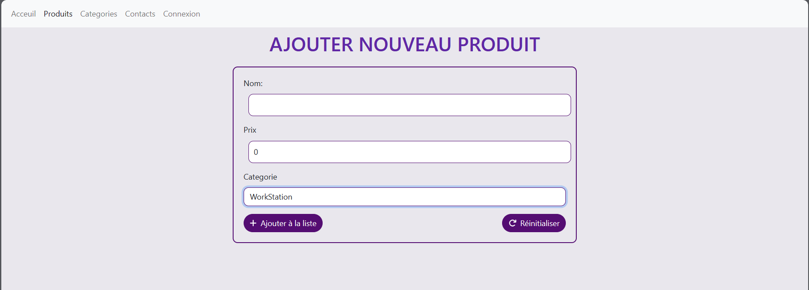
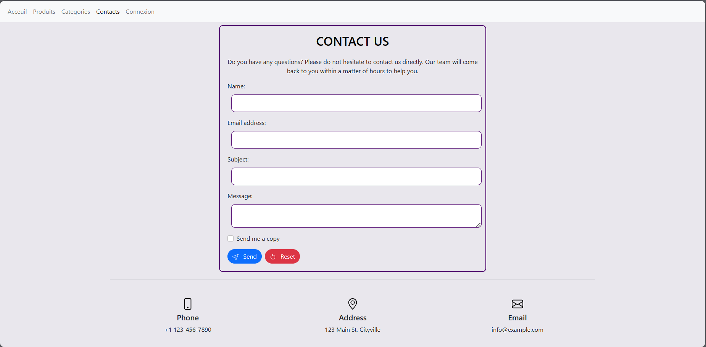
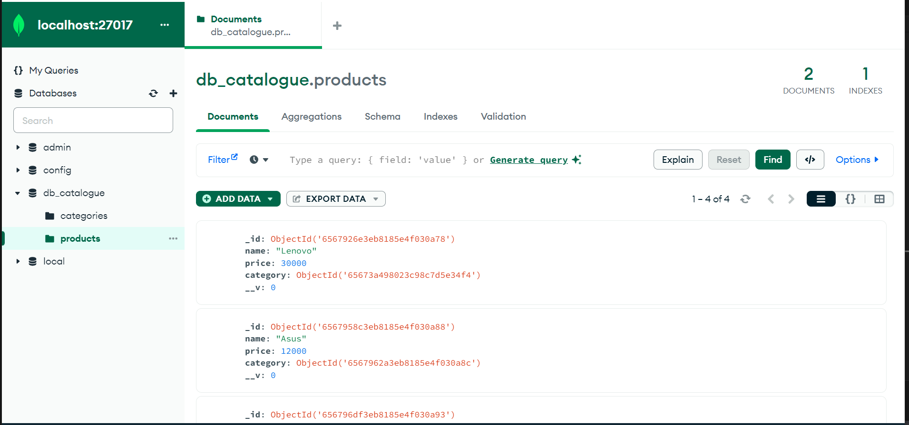

# ecommerce_project_react_nodeJs
<h1> Gestion des produits</h1>
<h2>Introduction</h2>

Ce projet a pour objectif le développement d'une application web complète dédiée à la gestion des produits. Il implémente les opérations CRUD (Create, Read, Update, Delete) pour les produits, les associant à différentes catégories. L'architecture de l'application suit le modèle client-serveur, avec le backend construit en utilisant Node.js et Express. La persistance des données est assurée par une base de données MongoDB, avec Mongoose pour la modélisation des objets.

Du côté frontend, l'interface utilisateur réactive est conçue en utilisant React, permettant une expérience utilisateur fluide et interactive. La gestion de la navigation au sein de l'application est assurée par React Router. De plus, l'ajout de Bootstrap apporte des composants et des styles prêts à l'emploi, améliorant l'esthétique et la convivialité de l'interface.

<h2>Technologies Utilisées</h2>
<h3>Backend</h3>
<ul>
<li>Node.js et Express pour le serveur.</li>
<li>MongoDB comme base de données.</li>
<li>Mongoose pour la modélisation des objets MongoDB.</li>
<li>Axios pour effectuer des requêtes HTTP du frontend vers le backend.</li>
</ul>
<h3>Frontend</h3>
<ul>
<li>React pour la création de l'interface utilisateur.</li>
<li>React Router pour la gestion de la navigation.</li>
<li>FontAwesome pour des icônes visuellement attrayantes.</li>
</ul>

<h2>Architecture</h2>

Ce projet suit une architecture modulaire avec une séparation claire des préoccupations. Les composants clés incluent :
<h3>Structure Backend :</h3>
<ul>
<li>Modèles : Définit la structure des données à l'aide des schémas Mongoose.</li>
<li>Contrôleurs : Gère la logique métier pour les opérations CRUD.</li>
<li>Routes : Définit les points d'API et les connecte aux méthodes de contrôleur respectives.</li>

</ul>
<h3>Structure Frontend :</h3>
<ul>
<li>Composants : Composants modulaires pour différentes sections (Accueil, Produits, Contacts, etc.).</li>
<li>Routing : Utilise React Router pour la navigation entre les différentes pages.
</li>
<li>Styles : Intègre des styles pour créer une interface engageante et visuellement plaisante.</li>
<li>Service (services) : Utilise Axios pour gérer les requêtes HTTP vers le backend</li>
</ul>

<h2>Pages Web </h2>
<h3>Page d'Accueil</h3>

<h3>Page d’inscription </h3>

<h3>Page de connexion </h3>

<h3>Page d'Ajout d'un produit</h3>

<h3>Page des Produits</h3>

<h3>Page de modification d'un produit</h3>

<h3>Page de Contacts</h3>

<h2>Base de données </h2>

<h2>Conclusion</h2>
Ce projet est une application web full-stack utilisant Node.js, Express, et MongoDB pour le backend, ainsi que React pour le frontend. L'application offre des fonctionnalités de gestion de produits, permettant aux utilisateurs de visualiser, ajouter, supprimer et modifier des produits. L'architecture est modulaire, avec des composants clés et une séparation claire des préoccupations. Chaque page, comme la page d'accueil, la liste de produits, le formulaire d'ajout, et les pages d'authentification, a une esthétique soignée et suit un thème global

