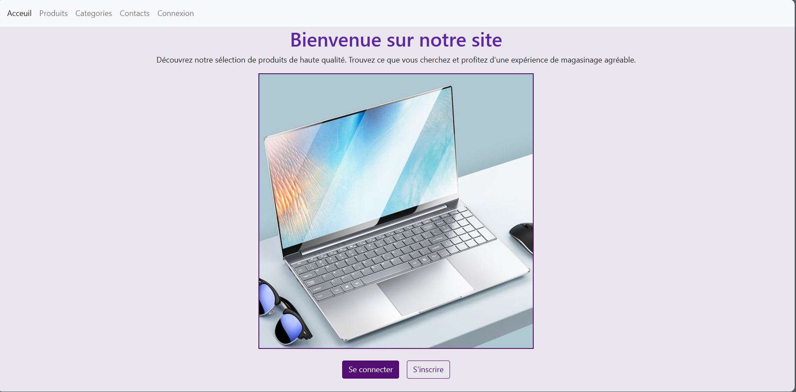
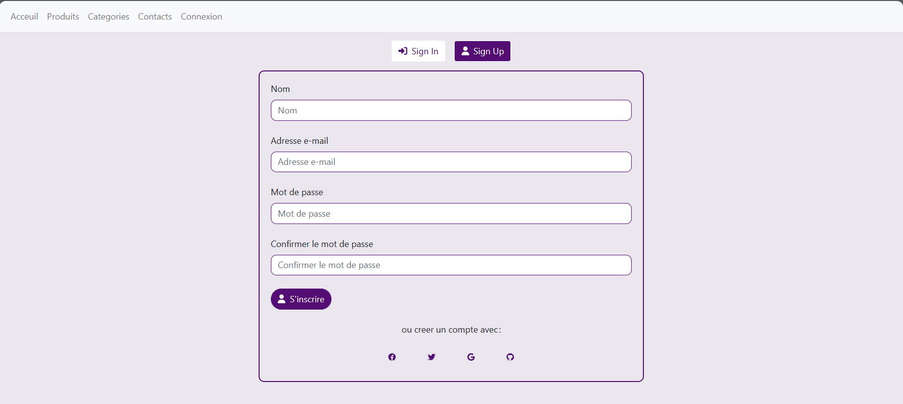
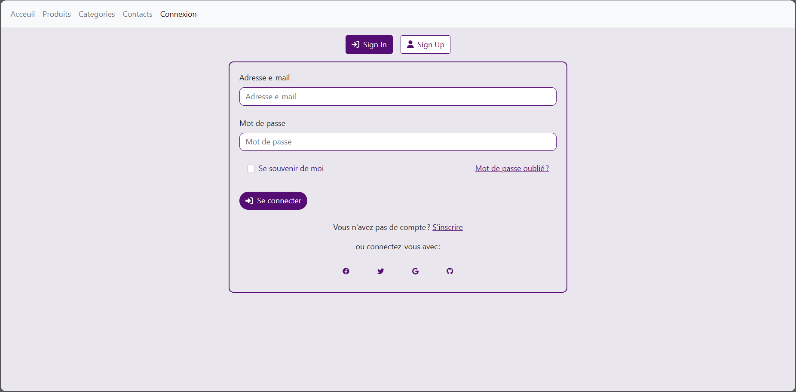
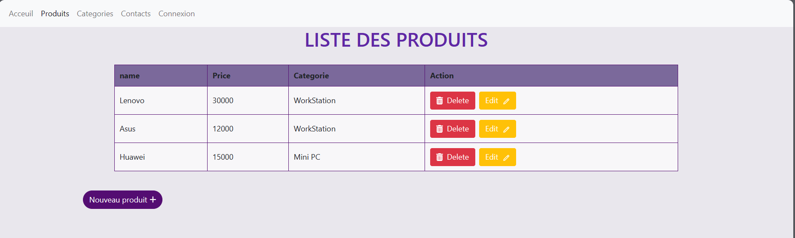
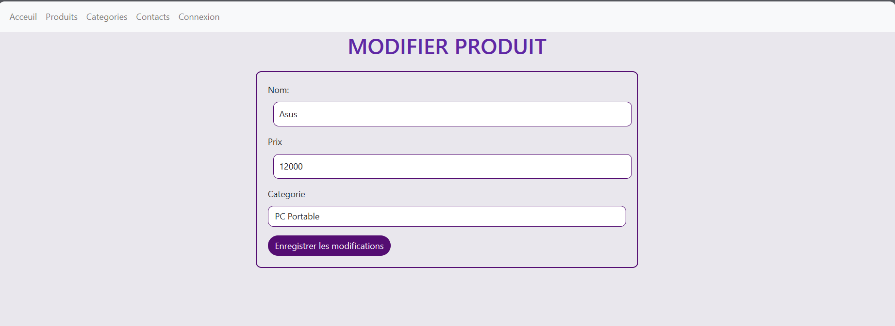

# ecommerce_project_react_nodeJs
<h1> Gestion des produits</h1>
<h2>Introduction</h2>
<h2>Technologies Utilisées</h2>
<h3>Backend</h3>
<ul>
<li>Node.js et Express pour le serveur.</li>
<li>MongoDB comme base de données.</li>
<li>Mongoose pour la modélisation des objets MongoDB.</li>
<li>Axios pour effectuer des requêtes HTTP du frontend vers le backend.</li>
</ul>
<h3>Frontend</h3>
<ul>
<li>React pour la création de l'interface utilisateur.</li>
<li>React Router pour la gestion de la navigation.</li>
<li>FontAwesome pour des icônes visuellement attrayantes.</li>
</ul>
<h2>Pages Web </h2>
<h3>Page d'Accueil</h3>

<h3>Page d’inscription </h3>

<h3>Page de connexion </h3>

<h3>Page d'Ajout d'un produit</h3>

<h3>Page des Produits</h3>

<h3>Page de Contacts</h3>

